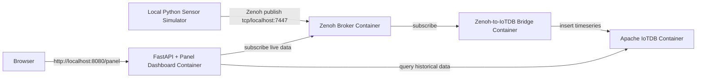

# ApacheCon 2022 IoT Demo: Zenoh, Apache IoTDB & Panel

This repository demonstrates an end-to-end, production-like IoT telemetry ingestion and visualization pipeline. It features a distributed architecture powered by **Eclipse Zenoh**, **Apache IoTDB**, and a **Panel + FastAPI** dashboard, all orchestrated via Docker Compose.

---

## Project Overview

The objective of this demo is to showcase how high-throughput sensor telemetry can be collected, bridged to a time-series database, and visualized in real-time.

- **Local Python Sensor Simulator**: Simulates a physical IoT machine sensor and publishes telemetry messages to a Zenoh broker.
- **Zenoh Broker**: Connects the simulator, the database bridge, and the web portal.
- **Zenoh-to-IoTDB Bridge**: Subscribes to the live Zenoh topic, validates incoming JSON data using Pydantic, and persists telemetry in Apache IoTDB.
- **FastAPI + Panel Dashboard**: Visualizes the metrics through two logically independent widgets:
  1. A real-time gauge and line chart receiving data directly from Zenoh.
  2. A bar chart updating periodically by querying historical data from Apache IoTDB.

---

## Architecture Diagram



---

## Prerequisites

- **Docker** and **Docker Compose**
- **Python 3.11+** or **3.12+** (for the local simulator and running test suites)
- **pip** and **venv** python tools

---

## Quick Start

Follow these simple steps to run the complete environment:

1. **Configure Environment Variables**:
   Copy the example environment file to `.env`:
   ```bash
   cp .env.example .env
   ```

2. **Spin Up the Containers**:
   Launch the Docker Compose services in the background:
   ```bash
   make up
   ```
   *This starts the Zenoh broker, Apache IoTDB, the ingestion bridge, and the dashboard portal.*

3. **Install Local Python Environment**:
   Initialize and activate a virtual environment, then install dependencies:
   ```bash
   python3 -m venv .venv
   source .venv/bin/activate
   pip install -r requirements-dev.txt
   ```

4. **Start the Sensor Simulator**:
   Run the local telemetry simulator to start publishing data:
   ```bash
   make simulator
   ```

5. **Open the Dashboard**:
   Navigate to the portal in your browser:
   [http://localhost:8080/panel](http://localhost:8080/panel)

---

## Service URLs

| Service / Port | Endpoint URL | Description |
| :--- | :--- | :--- |
| **FastAPI + Panel Dashboard** | [http://localhost:8080/panel](http://localhost:8080/panel) | Telemetry monitoring charts |
| **Dashboard Health Check** | [http://localhost:8080/health](http://localhost:8080/health) | API Status Check |
| **Dashboard Detailed Status** | [http://localhost:8080/api/status](http://localhost:8080/api/status) | Port and connection statistics |
| **Zenoh TCP Protocol** | `localhost:7447` | Used by simulator and external clients |
| **Zenoh REST API** | [http://localhost:8000](http://localhost:8000) | Zenoh Admin REST access |
| **Apache IoTDB Thrift RPC** | `localhost:6667` | Database connections |

---

## Common Developer Commands

The project includes a `Makefile` to simplify common operations:

- `make up` - Start the containerized services (`zenoh`, `iotdb`, `bridge`, `dashboard`).
- `make down` - Shut down and clean container instances, networks, and volumes.
- `make simulator` - Launch the local sensor simulator loop.
- `make integration-test` - Run all automated configurations and connectivity checks.
- `make clean` - Clean up python temporary caches.

---

## Data Model

### Zenoh Telemetry Payload (JSON)
The simulator publishes JSON objects representing telemetry reading records:
```json
{
  "sensor_id": "machine1-temperature",
  "device": "machine1",
  "measurement": "temperature",
  "value": 23.4,
  "unit": "celsius",
  "timestamp": "2026-07-09T12:00:00.000Z"
}
```

### Apache IoTDB Timeseries Path
The bridge persists data into the following time series path:
- `root.myfactory.machine1.temperature`

---

## Testing

You can verify the stability and correctness of your setup using the test suite. 

To run the tests:
```bash
make integration-test
```

The tests cover:
1. **Configuration**: Checking module defaults and environment overrides.
2. **Zenoh Connection**: Verifying publishing and subscribing loopback.
3. **IoTDB Connection**: Verifying schema creation, inserts, and queries.
4. **Bridge Flow**: E2E check. Sending a message to Zenoh and asserting it is successfully bridged to IoTDB.
5. **Dashboard Health**: Validating `/health` and `/api/status` API responses.

*Note: Integration tests (except configuration checks) require the Docker Compose stack to be running (`make up`). If the services are not running, integration tests will be skipped automatically.*

---

## Troubleshooting

- **Multicast Discovery Limits**: Docker multicast routing between host and containerized networks can be unstable. The sensor simulator is configured to bypass multicast and connect directly to Zenoh via `tcp/localhost:7447`.
- **Database Startup Latencies**: Apache IoTDB can take 15–20 seconds to boot up. The ingestion bridge and test suites use intelligent reconnect and retry loops to prevent startup failures.
- **Empty Charts**: If the dashboard charts are blank, verify that the simulator is running in your terminal (`make simulator`), and check the bridge container logs to verify database writes:
  ```bash
  docker compose logs -f zenoh-to-iotdb
  ```

---

## Migration Notes (from old Local Setup)

Starting Zenoh and Apache IoTDB services manually on your local system is no longer necessary. All core components run securely in Docker. Only the `sensor_simulator.py` script remains local to mimic an external physical device.
