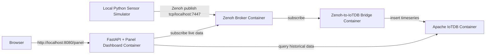

# ApacheCon 2022 IoT Demo: Zenoh, Apache IoTDB & Panel

This repository demonstrates an end-to-end, production-like IoT telemetry ingestion and visualization pipeline. It features a distributed architecture powered by **Eclipse Zenoh**, **Apache IoTDB**, and a **Panel + FastAPI** dashboard, all orchestrated via Docker Compose.

---

## Project Overview

The objective of this demo is to showcase how high-throughput sensor telemetry can be collected, bridged to a time-series database, and visualized in real-time.

- **Local Python Sensor Simulator**: Simulates a physical IoT machine sensor and publishes telemetry messages to a Zenoh broker.
- **Zenoh Broker**: Connects the simulator, the database bridge, and the web portal.
- **Zenoh-to-IoTDB Bridge**: Subscribes to the live Zenoh topic, validates incoming JSON data using Pydantic, and persists telemetry in Apache IoTDB.
- **FastAPI + Panel Dashboard**: Visualizes the metrics through two logically independent widgets:
  1. A real-time gauge and line chart receiving data directly from Zenoh.
  2. A bar chart updating periodically by querying historical data from Apache IoTDB.

---

## Architecture Diagram



---

## Prerequisites

- **Docker** and **Docker Compose**
- **Python 3.11+** or **3.12+** (for the local simulator and running test suites)
- **pip** and **venv** python tools

---

## Quick Start

Follow these simple steps to run the complete environment:

1. **Configure Environment Variables**:
   Copy the example environment file to `.env`:
   ```bash
   cp .env.example .env
   ```

2. **Spin Up the Containers**:
   Launch the Docker Compose services in the background:
   ```bash
   make up
   ```
   *This starts the Zenoh broker, Apache IoTDB, the ingestion bridge, and the dashboard portal.*

3. **Install Local Python Environment**:
   Initialize and activate a virtual environment, then install dependencies:
   ```bash
   python3 -m venv .venv
   source .venv/bin/activate
   pip install -r requirements-dev.txt
   ```

4. **Start the Sensor Simulator**:
   Run the local telemetry simulator to start publishing data:
   ```bash
   make simulator
   ```

5. **Open the Dashboard**:
   Navigate to the portal in your browser:
   [http://localhost:8080/panel](http://localhost:8080/panel)

---

## Service URLs

| Service / Port | Endpoint URL | Description |
| :--- | :--- | :--- |
| **FastAPI + Panel Dashboard** | [http://localhost:8080/panel](http://localhost:8080/panel) | Telemetry monitoring charts |
| **Dashboard Health Check** | [http://localhost:8080/health](http://localhost:8080/health) | API Status Check |
| **Dashboard Detailed Status** | [http://localhost:8080/api/status](http://localhost:8080/api/status) | Port and connection statistics |
| **Zenoh TCP Protocol** | `localhost:7447` | Used by simulator and external clients |
| **Zenoh REST API** | [http://localhost:8000](http://localhost:8000) | Zenoh Admin REST access |
| **Apache IoTDB Thrift RPC** | `localhost:6667` | Database connections |

---

## Run the Live Dashboard (Standalone)

You can run the Panel dashboard locally on your host machine to visualize both the real-time Zenoh stream and the persisted Apache IoTDB database values.

### Step-by-Step Instructions

1. **Start Zenoh Router, Apache IoTDB & Bridge**
   Spin up the containerized Zenoh broker, Apache IoTDB, and the ingestion bridge:
   ```bash
   docker compose up -d zenoh iotdb zenoh-to-iotdb
   ```
   *(Note: The database container will initialize and run its internal health check. It takes ~20 seconds to be fully ready.
   The `zenoh-to-iotdb` bridge subscribes to Zenoh and writes values into IoTDB — without it the IoTDB chart will remain empty.)*

2. **Prepare Python Environment**
   Activate your virtual environment and make sure dependencies are installed:
   ```bash
   source .venv/bin/activate  # Or .venv\Scripts\activate on Windows
   pip install -r requirements.txt
   ```

3. **Start the Zenoh Producer**
   Run the standalone educational sensor simulator to start publishing telemetry:
   ```bash
   python zenoh_producer.py
   ```
   *(This starts publishing JSON telemetry readings to `myfactory/machine1/temperature` at a 1-second interval).*

4. **Start the Panel Dashboard**
   Launch the Panel application directly:
   ```bash
   panel serve panel_script.py --autoreload --show
   ```
   *This will open the dashboard in your default browser at [http://localhost:5006/panel_script](http://localhost:5006/panel_script).*

### Default Configuration Values
The standalone dashboard and helper scripts use the following default configurations (can be overridden via environment variables or `.env`):
- **Zenoh Router Endpoint**: `tcp/localhost:7447` (configurable via `ZENOH_HOST_ENDPOINT`)
- **Zenoh Subscription Key**: `myfactory/machine1/temperature` (configurable via `ZENOH_KEY_EXPRESSION`)
- **Apache IoTDB Host/Port**: `127.0.0.1:6667` (configurable via `IOTDB_HOST`/`IOTDB_PORT`)
- **Apache IoTDB Path**: `root.myfactory.machine1.temperature` (configurable via `IOTDB_DEVICE`/`IOTDB_MEASUREMENT`)
- **UI Refresh Rates**: 1000 ms for Zenoh Stream, 2000 ms for IoTDB query.

---

## Common Developer Commands

The project includes a `Makefile` to simplify common operations:

- `make up` - Start the containerized services (`zenoh`, `iotdb`, `bridge`, `dashboard`).
- `make down` - Shut down and clean container instances, networks, and volumes.
- `make simulator` - Launch the local sensor simulator loop.
- `make integration-test` - Run all automated configurations and connectivity checks.
- `make clean` - Clean up python temporary caches.

---

## Data Model

### Zenoh Telemetry Payload (JSON)
The simulator publishes JSON objects representing telemetry reading records:
```json
{
  "sensor_id": "machine1-temperature",
  "device": "machine1",
  "measurement": "temperature",
  "value": 23.4,
  "unit": "celsius",
  "timestamp": "2026-07-09T12:00:00.000Z"
}
```

### Apache IoTDB Timeseries Path
The bridge persists data into the following time series path:
- `root.myfactory.machine1.temperature`

---

## Testing

You can verify the stability and correctness of your setup using the test suite. 

To run the tests:
```bash
make integration-test
```

The tests cover:
1. **Configuration**: Checking module defaults and environment overrides.
2. **Zenoh Connection**: Verifying publishing and subscribing loopback.
3. **IoTDB Connection**: Verifying schema creation, inserts, and queries.
4. **Bridge Flow**: E2E check. Sending a message to Zenoh and asserting it is successfully bridged to IoTDB.
5. **Dashboard Health**: Validating `/health` and `/api/status` API responses.
6. **Dashboard ECharts rendering (unit)**: `tests/test_dashboard_echarts.py` verifies the `create_echarts_option` builder produces a valid ECharts option dict (axes, series, data wiring) and that the `pn.pane.ECharts` pane is constructed with the correct configuration.
7. **Dashboard rendering (integration)**: `tests/test_dashboard_integration.py` boots the **exact** FastAPI+Panel app the container runs (`uvicorn app.main:app`) in-process and asserts `GET /panel` returns HTTP 200 with the ECharts library embedded **locally** (no external CDN).
8. **Dashboard rendering (E2E, browser)**: `tests/test_dashboard_e2e.py` loads `/panel` in a headless Chromium (Playwright) and asserts the ECharts canvases mount and receive data. Skipped automatically when Playwright or a running server is unavailable.

*Note: Integration tests (except configuration checks) require the Docker Compose stack to be running (`make up`). If the services are not running, integration tests will be skipped automatically.*

### Running the dashboard/rendering tests specifically

```bash
# Unit + integration (no Docker, no browser required)
python -m pytest tests/test_dashboard_echarts.py tests/test_dashboard_integration.py -v

# End-to-end (requires a running dashboard + Playwright Chromium)
pip install playwright && playwright install --with-deps chromium
export DASHBOARD_URL=http://localhost:8080   # or DASHBOARD_PORT
python -m pytest tests/test_dashboard_e2e.py -v
```

To run the **whole** suite:

```bash
make integration-test
```


---

## Troubleshooting

- **Multicast Discovery Limits**: Docker multicast routing between host and containerized networks can be unstable. The sensor simulator is configured to bypass multicast and connect directly to Zenoh via `tcp/localhost:7447`.
- **Database Startup Latencies**: Apache IoTDB can take 15–20 seconds to boot up. The ingestion bridge and test suites use intelligent reconnect and retry loops to prevent startup failures.
- **Empty Charts / No Zenoh Data**: If the Zenoh chart is blank, verify that the simulator is running in your terminal (`python zenoh_producer.py` or `make simulator`) and publishing to the exact same key expression (`myfactory/machine1/temperature`) and endpoint (`tcp/localhost:7447`).
- **Empty Charts / No IoTDB Data**: Ensure the database bridge container is running to persist Zenoh data to IoTDB (`docker compose ps` and `docker compose logs -f zenoh-to-iotdb`).
- **IoTDB Connection Refused**: Verify Apache IoTDB is fully up and listening on port `6667`. Check container status with `docker compose ps` and ensure no other process is bound to port `6667` on the host.
- **Zenoh Subscriber Receives No Samples**: Ensure the publisher is connecting to the correct broker IP/port and is using the exact same key expression (without a leading slash, as Zenoh 1.x path expressions must not start with `/`).
- **Dashboard page is blank / ECharts panes never appear**: The whole dashboard fails to render (HTTP 500 or blank page) if `app/dashboard.py` raises while building the view. The most common cause was a hard-coded absolute logo path (`/app/app/asf-estd-1999-logo.jpg`) combined with `pn.pane.JPG(..., embed=True)` — Panel fetches embedded images via `requests.get`, so a missing/scheme-less path raises `MissingSchema` and aborts `template.server_doc`. The path is now resolved relative to the package (`os.path.join(<pkg>/app/...)`) and guarded with `os.path.exists`. If you still see a blank page, check the container logs for `MissingSchema`/`server_doc` tracebacks and confirm the logo file ships at `/app/app/asf-estd-1999-logo.jpg` (Dockerfile copies `app/` to `/app/app/`).
- **ECharts library fails to load (offline container)**: Modern Panel bundles the ECharts JS locally under `static/extensions/panel/bundled/echarts/`, so no internet is required at runtime. If you pin an older Panel (pre-1.4) that loads ECharts from a CDN, the charts will stay blank in an offline container — keep `panel>=1.3.0` resolved to a current release (≥1.4) or pin an explicit modern version.
- **ECharts Pane Does Not Update**: Make sure you did not modify the chart data dictionary without triggering the change event. If updating values, always call `chart_pane.param.trigger('data')` to force a browser refresh.

---

## Migration Notes (from old Local Setup)

Starting Zenoh and Apache IoTDB services manually on your local system is no longer necessary. All core components run securely in Docker. Only the `sensor_simulator.py` script remains local to mimic an external physical device.
